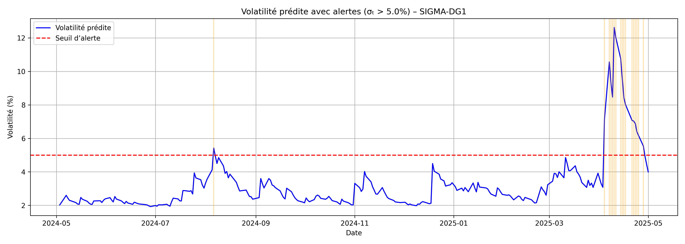

# SIGMA-DG1

**Prédiction de volatilité GARCH(1,1), détection automatique de jours à risque, et simulation d'un portefeuille dynamique piloté par XGBoost.**



---

## 🇫🇷 Version française

### Aperçu

SIGMA-DG1 est un système de bout en bout pour surveiller le risque d'un actif financier (ici SPXL, l'ETF S&P 500 3x levier) :
1. **Prédire** sa volatilité conditionnelle avec un modèle GARCH(1,1)
2. **Détecter automatiquement** les jours à risque élevé/critique
3. **Simuler** un portefeuille dont l'exposition s'ajuste dynamiquement à la volatilité, via un modèle XGBoost
4. **Générer** un rapport PDF de synthèse (alertes, graphiques, métriques)

### Résultat clé

Sur la période observée, le portefeuille dynamique (XGBoost) est comparé à une allocation statique à 30% :

| Portefeuille | Valeur finale | Sharpe Ratio | Max Drawdown |
|---|---|---|---|
| Dynamique (XGBoost) | **1.0179** | **0.194** | **-30.1%** |
| Statique (30%) | 1.0040 | 0.088 | -18.8% |

Le portefeuille dynamique obtient un **meilleur rendement ajusté au risque** (Sharpe plus de 2x supérieur), mais au prix d'un **drawdown plus profond**. C'est un résultat honnête et attendu : le modèle XGBoost apprend à reproduire une règle d'allocation basée sur des seuils de volatilité (poids réduit quand la volatilité prédite dépasse 5%, encore réduit au-delà de 7%) plutôt qu'un signal optimal appris de façon totalement indépendante — un Sharpe plus élevé ne veut pas dire automatiquement moins de risque de queue. Cette limite méthodologique est assumée, pas cachée (voir *Limites* ci-dessous).

### Fonctionnalités

- **Prédiction de volatilité** — GARCH(1,1) sur les rendements logarithmiques, volatilité conditionnelle jour par jour
- **Détection d'alertes** — seuil configurable (défaut : σ > 5%), classification en 3 niveaux de risque (modéré / élevé / critique)
- **Simulation de portefeuille dynamique** — XGBoost entraîné sur volatilité et rendements décalés (`vol_shift`, `ret_shift`, moyennes glissantes) pour prédire un poids d'allocation, comparé à une allocation statique
- **Rapport PDF automatique** — titres, résumé, tableau d'alertes, graphiques, métriques de simulation, nom de l'actif analysé

### Structure du projet

```
SIGMA-DG1/
├── main.py                        # Pipeline complet (collecte → GARCH → alertes → simulation → rapport)
├── src/
│   ├── data_loader.py              # Téléchargement des prix (API EODHD)
│   ├── garch_model.py              # Entraînement GARCH(1,1)
│   ├── volatility_predictor.py     # Prédiction + génération d'alertes
│   ├── simulator.py                # Simulation de portefeuille XGBoost
│   ├── report_generator.py         # Génération du rapport PDF
│   └── utils.py                    # Classification de risque, métriques MAE/RMSE
├── notebooks/
│   ├── 01_data_collection.ipynb
│   ├── 02_garch_model.ipynb
│   └── 03_visualization.ipynb
├── outputs/
│   ├── figures/                    # Graphiques (volatilité, alertes, simulation)
│   ├── predictions/volatility_alerts.csv
│   └── volatility_report_SIGMA_DG1.pdf
├── tests/
│   └── test_risk_utils.py
├── requirements.txt
├── .env.example
└── LICENSE
```

### Installation

```bash
git clone <url-du-dépôt>
cd SIGMA-DG1
python -m venv venv
source venv/bin/activate        # Windows : venv\Scripts\activate
pip install -r requirements.txt
cp .env.example .env            # puis renseigner ta clé API EODHD (gratuite sur eodhistoricaldata.com)
```

### Utilisation

```bash
python main.py
```

Génère le rapport complet dans `outputs/volatility_report_SIGMA_DG1.pdf`.

### Tests

```bash
pytest tests/
```

Les tests couvrent la classification de risque (bornes modéré/élevé/critique), la génération d'alertes par seuil, et le calcul MAE/RMSE.

### Stack technique

Python · pandas · NumPy · arch (GARCH) · XGBoost · scikit-learn · Matplotlib · ReportLab (PDF) · pytest

### Limites & pistes d'amélioration

- La cible d'entraînement XGBoost (`target_weight`) est elle-même une règle basée sur des seuils de volatilité, pas un poids optimal appris indépendamment — le modèle apprend donc à approximer une heuristique plutôt qu'à découvrir une allocation optimale. Une prochaine version pourrait définir la cible via une optimisation rétrospective (ex : poids qui aurait maximisé le Sharpe réalisé).
- Actif unique (SPXL) — étendre à un portefeuille multi-actifs.
- Pas de prise en compte des coûts de transaction dans la simulation.
- Intégration de facteurs macroéconomiques, interface web (Flask/Streamlit).

---

## 🇬🇧 English version

### Overview

SIGMA-DG1 is an end-to-end system for monitoring the risk of a financial asset (here SPXL, the 3x-leveraged S&P 500 ETF):
1. **Predict** its conditional volatility with a GARCH(1,1) model
2. **Automatically detect** high/critical risk days
3. **Simulate** a portfolio whose exposure dynamically adjusts to volatility, via an XGBoost model
4. **Generate** a summary PDF report (alerts, charts, metrics)

### Key result

Over the observed period, the dynamic (XGBoost) portfolio is compared to a static 30% allocation:

| Portfolio | Final value | Sharpe Ratio | Max Drawdown |
|---|---|---|---|
| Dynamic (XGBoost) | **1.0179** | **0.194** | **-30.1%** |
| Static (30%) | 1.0040 | 0.088 | -18.8% |

The dynamic portfolio achieves a **better risk-adjusted return** (Sharpe more than 2x higher), but at the cost of a **deeper drawdown**. This is an honest, expected result: the XGBoost model learns to reproduce a volatility-threshold allocation rule (reduced weight above 5% predicted volatility, reduced further above 7%) rather than an independently-learned optimal signal — a higher Sharpe doesn't automatically mean lower tail risk. This methodological limitation is stated openly, not hidden (see *Limitations* below).

### Features

- **Volatility prediction** — GARCH(1,1) on log-returns, day-by-day conditional volatility
- **Alert detection** — configurable threshold (default: σ > 5%), 3-level risk classification (moderate / high / critical)
- **Dynamic portfolio simulation** — XGBoost trained on lagged volatility and returns (`vol_shift`, `ret_shift`, rolling means) to predict an allocation weight, benchmarked against a static allocation
- **Automated PDF report** — titles, summary, alert table, charts, simulation metrics, analyzed asset name

### Project structure

```
SIGMA-DG1/
├── main.py                        # Full pipeline (collection → GARCH → alerts → simulation → report)
├── src/
│   ├── data_loader.py              # Price download (EODHD API)
│   ├── garch_model.py              # GARCH(1,1) training
│   ├── volatility_predictor.py     # Prediction + alert generation
│   ├── simulator.py                # XGBoost portfolio simulation
│   ├── report_generator.py         # PDF report generation
│   └── utils.py                    # Risk classification, MAE/RMSE metrics
├── notebooks/
│   ├── 01_data_collection.ipynb
│   ├── 02_garch_model.ipynb
│   └── 03_visualization.ipynb
├── outputs/
│   ├── figures/                    # Charts (volatility, alerts, simulation)
│   ├── predictions/volatility_alerts.csv
│   └── volatility_report_SIGMA_DG1.pdf
├── tests/
│   └── test_risk_utils.py
├── requirements.txt
├── .env.example
└── LICENSE
```

### Installation

```bash
git clone <repo-url>
cd SIGMA-DG1
python -m venv venv
source venv/bin/activate        # Windows: venv\Scripts\activate
pip install -r requirements.txt
cp .env.example .env            # then fill in your EODHD API key (free tier at eodhistoricaldata.com)
```

### Usage

```bash
python main.py
```

Generates the full report at `outputs/volatility_report_SIGMA_DG1.pdf`.

### Tests

```bash
pytest tests/
```

Tests cover risk classification (moderate/high/critical boundaries), threshold-based alert generation, and MAE/RMSE computation.

### Tech stack

Python · pandas · NumPy · arch (GARCH) · XGBoost · scikit-learn · Matplotlib · ReportLab (PDF) · pytest

### Limitations & next steps

- The XGBoost training target (`target_weight`) is itself a volatility-threshold rule, not an independently-learned optimal weight — so the model learns to approximate a heuristic rather than discover an optimal allocation. A future version could define the target via retrospective optimization (e.g., the weight that would have maximized realized Sharpe).
- Single asset (SPXL) — extend to a multi-asset portfolio.
- No transaction costs in the simulation.
- Macroeconomic factor integration, web interface (Flask/Streamlit).

---

## Author

**Deo ZANTOKO** — Engineering student in Applied Mathematics, Mathematical Modelling for Finance & Insurance (MMFA), CY Tech

## License

MIT — see [LICENSE](LICENSE).
